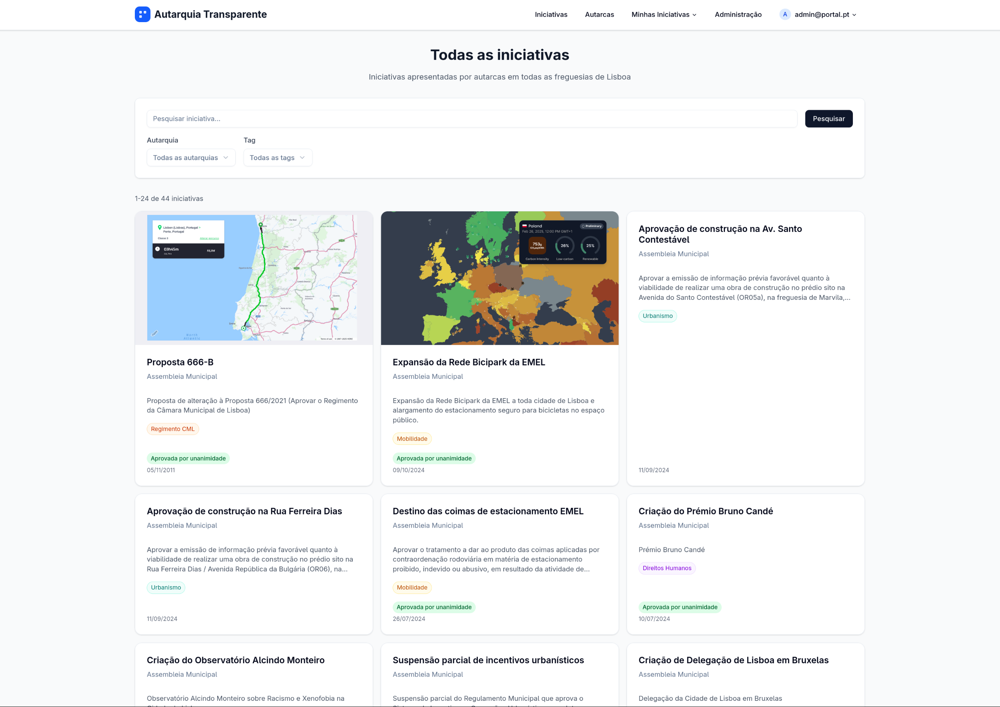
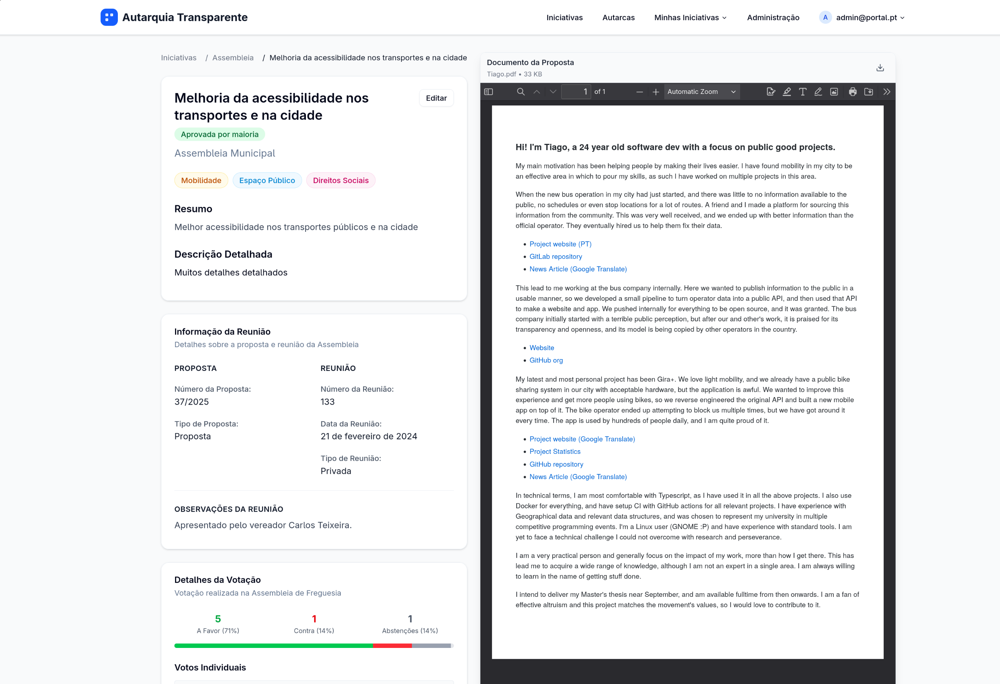
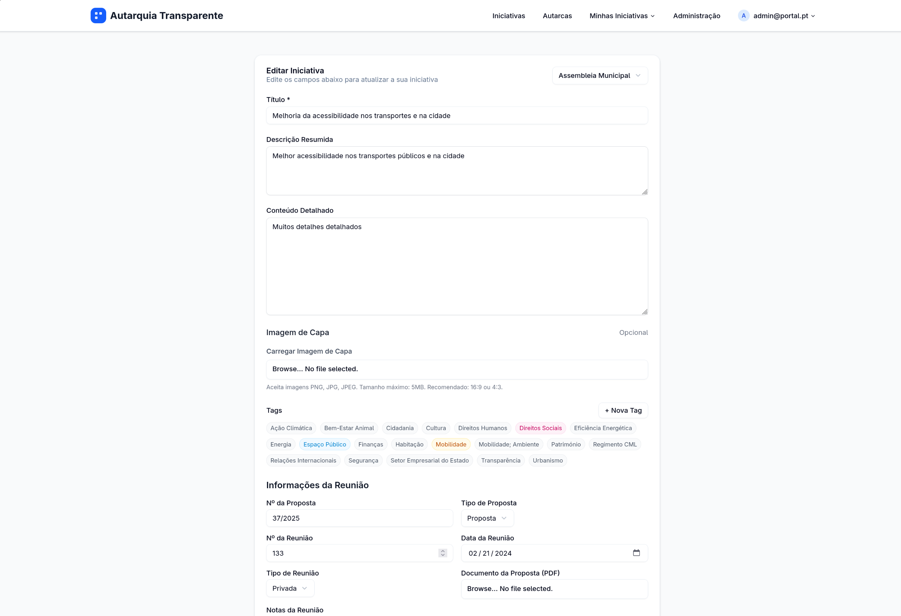

# Portal Autarca

O Portal Autarca é uma plataforma open-source desenhada para gerir e apresentar as iniciativas e propostas de autarquias e freguesias. O objetivo é aumentar a transparência e facilitar o acesso à informação, permitindo que os cidadãos acompanhem a atividade política local.



## Funcionalidades

- **Visualização de Iniciativas**: Acompanhe propostas, votações e o estado de cada iniciativa.
- **Filtros e Pesquisa**: Encontre facilmente iniciativas por autarquia, estado ou tags.
- **Detalhes da Iniciativa**: Veja informações detalhadas, incluindo documentos, votos e datas importantes.
- **Backoffice**: Uma área de gestão para os responsáveis de cada autarquia inserirem e atualizarem as suas iniciativas.

## Screenshots

<table>
  <tr>
    <td></td>
    <td></td>
  </tr>
  <tr>
    <td align="center"><i>Página de detalhes da iniciativa</i></td>
    <td align="center"><i>Backoffice para gestão de iniciativas</i></td>
  </tr>
</table>

## Como Começar

1. **Clone o repositório**:
   ```bash
   git clone https://github.com/seu-usuario/portal-autarca.git
   cd portal-autarca
   ```

2. **Instale as dependências**:
   ```bash
   bun install
   ```

3. **Configure as variáveis de ambiente**:
   - Copie o ficheiro `.env.example` para `.env` e preencha as variáveis necessárias.

4. **Inicie o servidor de desenvolvimento**:
   ```bash
   bun --bun run dev
   ```

A aplicação estará disponível em `http://localhost:5173`.